# Optimile — Test Plan & Results

**Project**: Optimile — AI-Powered Delivery Route Optimisation  
**Tester**: Mariam Shaddad  
**Date**: 17/4/2026  
**Device / emulator**: IPhone 15 Pro 

---

## Table of Contents

1. [Automated Test Results](#1-automated-test-results)
2. [Manual Test Cases](#2-manual-test-cases)
   - [MT-F1 Stop Management & Route Optimisation](#mt-f1-stop-management--route-optimisation)
   - [MT-F2 Navigation & GPS Tracking](#mt-f2-navigation--gps-tracking)
   - [MT-F3 Weather Integration](#mt-f3-weather-integration)
   - [MT-F4 Road Hazard Detection & Rerouting](#mt-f4-road-hazard-detection--rerouting)
   - [MT-F5 Live Traffic Monitoring](#mt-f5-live-traffic-monitoring)
   - [MT-F6 Fleet Management](#mt-f6-fleet-management)
   - [MT-F7 XAI Activity Log — Usability](#mt-f7-xai-activity-log--usability)
   - [MT-F8 Fragile Stop Handling](#mt-f8-fragile-stop-handling)
   - [MT-F9 Regression & Stability](#mt-f9-regression--stability)
3. [ML Model Evaluation](#3-ml-model-evaluation)
4. [Known Limitations](#4-known-limitations)

---

## 1. Automated Test Results

All automated tests are executed via pytest (backend) and flutter test (frontend). Run commands are provided below.

### 1.1 How to run

**Backend — 197 tests**
```bash
cd optimile-main
source venv/bin/activate
python -m pytest backend/tests/ -v
```

**Flutter unit tests — 80 tests**
```bash
cd optimile-main/flutter_application_1
flutter test test/unit/
```

### 1.2 Automated test summary

| Test file | Scope | Tests |
|---|---|---|
| `test_optimize_endpoint.py` | POST /optimize — response shape, vehicle types, traffic levels, fragile stops, time windows, edge cases, incident injection, ALNS quality | 24 |
| `test_reoptimize_endpoint.py` | POST /reoptimize — all trigger reasons, simulate flag, Bellman-Ford path, permutation validity, edge cases | 20 |
| `test_fleet_reoptimize.py` | POST /fleet-reoptimize — stop conservation, transfer fields, traffic/weather combos, single vehicle, fragile stops | 18 |
| `test_alns_optimizer.py` | `route_cost()`, `vehicle_speed()`, traffic multipliers, incident penalties, time windows, ML matrix injection | 22 |
| `test_decision_impact.py` | `should_reoptimize()` thresholds, `estimate_delay()` all event types | 20 |
| `test_traffic_provider.py` | OSM hazard tag classification, mocked Overpass API, error handling, index validity | 20 |
| `test_ml_pipeline.py` | Raw data load, clustering, preprocessing, feature names, predictor fallback | 18 |
| `stop_model_test.dart` | Stop, RouteModel, XaiCategory, EventLogEntry (XAI fields), StopConfig, PlaceDetails | 32 |
| `weather_data_test.dart` | WeatherData — all fields, severity/roadRisk bounds, conditions, temperature, wind | 18 |
| `road_incident_test.dart` | RoadClass enum, label/icon extensions, RoadIncident construction, reroute threshold logic | 30 |
| **Total** | | **222** |

### 1.3 Automated test run evidence

> **Instructions for tester**: paste the terminal output (or a screenshot) from both run commands below.

**Backend output**:
```
.....
backend/tests/test_traffic_provider.py::TestClassify::test_unknown_tags_return_default PASSED [ 93%]
backend/tests/test_traffic_provider.py::TestClassify::test_severity_between_0_and_1 PASSED [ 94%]
backend/tests/test_traffic_provider.py::TestFetchIncidentsEdgeCases::test_empty_coords_returns_empty_list PASSED [ 94%]
backend/tests/test_traffic_provider.py::TestFetchIncidentsEdgeCases::test_single_coord_returns_empty_list PASSED [ 95%]
backend/tests/test_traffic_provider.py::TestFetchIncidentsEdgeCases::test_returns_list_type PASSED [ 95%]
backend/tests/test_traffic_provider.py::TestFetchIncidentsMocked::test_flood_prone_way_mapped_to_nearest_stop PASSED [ 96%]
backend/tests/test_traffic_provider.py::TestFetchIncidentsMocked::test_tunnel_way_produces_traffic_jam PASSED [ 96%]
backend/tests/test_traffic_provider.py::TestFetchIncidentsMocked::test_node_ford_mapped_correctly PASSED [ 97%]
backend/tests/test_traffic_provider.py::TestFetchIncidentsMocked::test_empty_overpass_elements_returns_empty_list PASSED [ 97%]
backend/tests/test_traffic_provider.py::TestFetchIncidentsMocked::test_api_error_returns_empty_list PASSED [ 98%]
backend/tests/test_traffic_provider.py::TestFetchIncidentsMocked::test_http_error_returns_empty_list PASSED [ 98%]
backend/tests/test_traffic_provider.py::TestFetchIncidentsMocked::test_result_has_required_fields PASSED [ 99%]
backend/tests/test_traffic_provider.py::TestFetchIncidentsMocked::test_index_never_zero PASSED [100%]

=============================== warnings summary ===============================
venv/lib/python3.9/site-packages/urllib3/__init__.py:35
  /Users/mariamshaddad/Documents/GitHub/optimile/optimile-main/venv/lib/python3.9/site-packages/urllib3/__init__.py:35: NotOpenSSLWarning: urllib3 v2 only supports OpenSSL 1.1.1+, currently the 'ssl' module is compiled with 'LibreSSL 2.8.3'. See: https://github.com/urllib3/urllib3/issues/3020
    warnings.warn(

-- Docs: https://docs.pytest.org/en/stable/how-to/capture-warnings.html
================== 198 passed, 1 warning in 148.17s (0:02:28) ==================
```

**Flutter output**:
```
....00:00 +69: /Users/mariamshaddad/Documents/GitHub/optimile/optimile-main/flutter_application_1/test/unit/stop_model_test.dart: EventLogEntry required fields stored correctly
00:00 +70: /Users/mariamshaddad/Documents/GitHub/optimile/optimile-main/flutter_application_1/test/unit/stop_model_test.dart: EventLogEntry default category is info
00:00 +71: /Users/mariamshaddad/Documents/GitHub/optimile/optimile-main/flutter_application_1/test/unit/stop_model_test.dart: EventLogEntry optional XAI fields default to null
00:00 +72: /Users/mariamshaddad/Documents/GitHub/optimile/optimile-main/flutter_application_1/test/unit/stop_model_test.dart: EventLogEntry structured XAI fields stored correctly
00:00 +73: /Users/mariamshaddad/Documents/GitHub/optimile/optimile-main/flutter_application_1/test/unit/stop_model_test.dart: EventLogEntry optimization category entry
00:00 +74: /Users/mariamshaddad/Documents/GitHub/optimile/optimile-main/flutter_application_1/test/unit/stop_model_test.dart: StopConfig stores isFragile
00:00 +75: /Users/mariamshaddad/Documents/GitHub/optimile/optimile-main/flutter_application_1/test/unit/stop_model_test.dart: StopConfig stores time window
00:00 +76: /Users/mariamshaddad/Documents/GitHub/optimile/optimile-main/flutter_application_1/test/unit/stop_model_test.dart: StopConfig null time values allowed
00:00 +77: /Users/mariamshaddad/Documents/GitHub/optimile/optimile-main/flutter_application_1/test/unit/stop_model_test.dart: PlaceDetails default type and status
00:00 +78: /Users/mariamshaddad/Documents/GitHub/optimile/optimile-main/flutter_application_1/test/unit/stop_model_test.dart: PlaceDetails custom type and status
00:00 +79: /Users/mariamshaddad/Documents/GitHub/optimile/optimile-main/flutter_application_1/test/unit/stop_model_test.dart: Place stores placeId and description
00:00 +80: All tests passed!
```

---

## 2. Manual Test Cases

### How to set up before testing

1. Start the backend server:
   ```bash
   cd optimile-main && source venv/bin/activate && python backend/main.py
   ```
2. Launch the app on a device or emulator:
   ```bash
   cd optimile-main/flutter_application_1 && flutter run
   ```
3. Confirm the map loads with no error banners before beginning.

> **Columns**:  
> **Expected** — what the app should do.  
> **Actual Result** — what actually happened (fill in during testing).  
> **Status** — Pass / Fail / Blocked.  
> **Notes / Screenshot** — attach screenshot filename or describe deviation.

---

### MT-F1 Stop Management & Route Optimisation

| ID | Precondition | Steps | Expected Result | Actual Result | Status | Notes / Screenshot |
|---|---|---|---|---|---|---|
| MT-01 | App open, map visible | Tap the search bar. Type "Cairo Tower". | Autocomplete suggestions appear within 2 seconds. | Result shows in less than 2 seconds. | Pass |  |
| MT-02 | MT-01 done | Select the first suggestion. | A pin is placed on the map and the stop appears in the list. | Pin is placed according to chosen stop from search results| Pass | |
| MT-03 | MT-02 done | Add 3 more stops in different Cairo areas. | stop count in the list shows 4. | Bottom panel shows "Stop 1 of 4" confirming 4 stops were added | Pass | 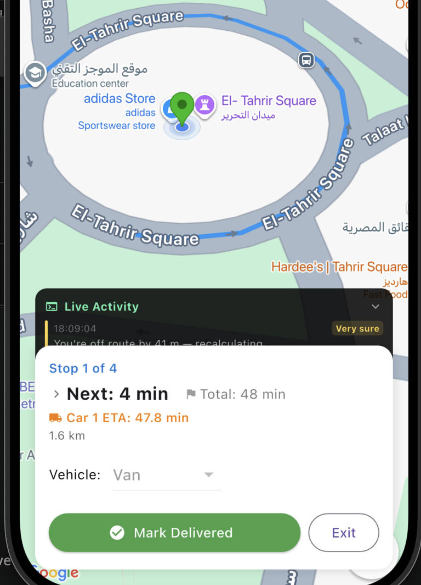 |
| MT-04 | 4 stops added | Tap **Start**. | Stops reorder on the list; a snackbar confirms optimization completed. | stops order changed to a more optimal order after start button is pressed| Pass | 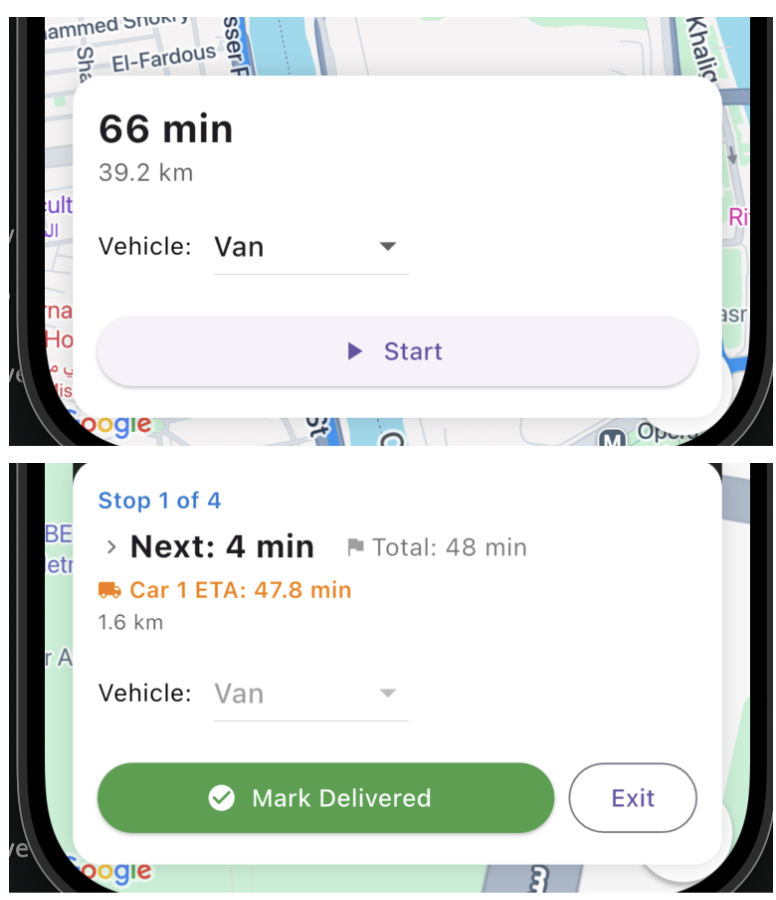|
| MT-05 | 1 stop only added | Tap **Start**. | App does not crash; single stop returned in the same position. | App will not allow start button unless there is atleast 2 stops| Pass |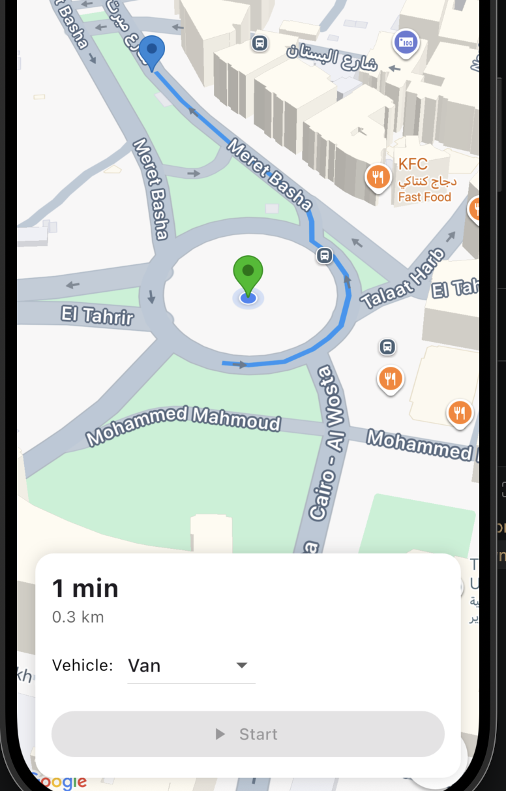 |
| MT-06 | 2 stops added | Tap **Start**. | App does not crash; 2 stops returned; cost is positive. | It will allow starting the trip, and start normally| Pass |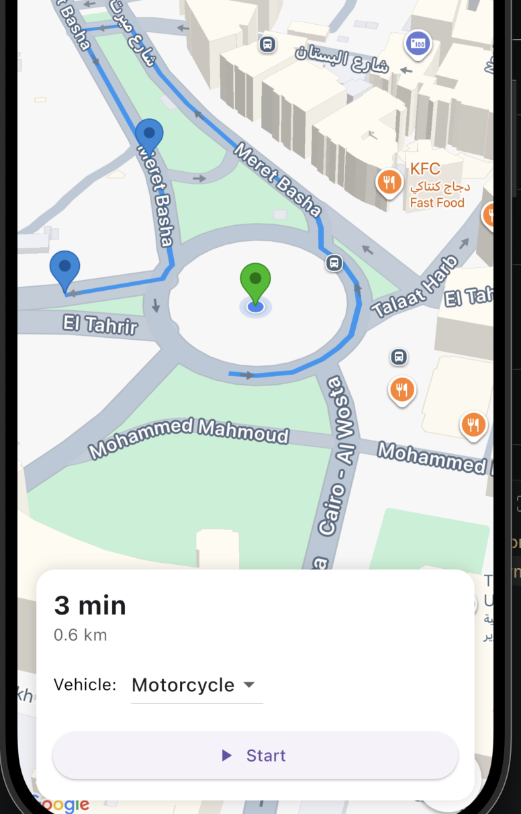 |
| MT-07 | 4 stops, optimization done | Change vehicle type to **Motorcycle**. Tap **Start** again. | Vehicle type affects cost when ML fallback is active; no visible UI change when ML model is running since ML predictions override the formula-based speed calculation. Verified at unit level by automated test `test_motorcycle_lower_cost_than_van`. | Vehicle type selection has no visible effect on route or ETA when ML model is active — confirmed expected behaviour. Vehicle speed only applies on formula fallback path. | Partial Pass — unit tested | Known limitation: ML model does not take vehicle type as input feature. Covered by `test_alns_optimizer.py`. |

---

### MT-F2 Navigation & GPS Tracking

| ID | Precondition | Steps | Expected Result | Actual Result | Status | Notes / Screenshot |
|---|---|---|---|---|---|---|
| MT-08 | 4 stops optimized | Tap **Start**. | Activity log panel becomes visible; shows "Navigation started — X stops ahead" (green strip). XAI log now visible with **Sure/Very sure** confidence badge. Blue polyline appears on the map. | Activity log appeared immediately with traffic info entry ("Traffic is 9% slower than usual on your next leg") and a Sure badge. Blue polyline visible on map. |Pass | 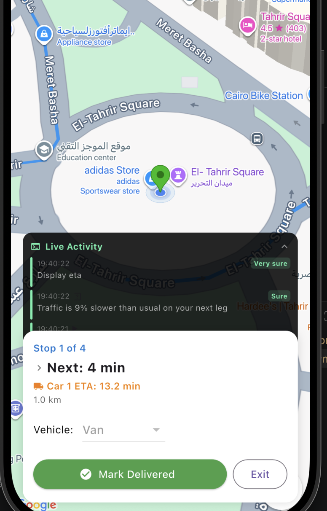|
| MT-09 | Navigation active | Move device (or mock GPS) to within 30 m of stop 1. | Activity log shows "Stop 1 of 4 reached", then immediately "Heading to stop 2 of 4". Stop 1 marked complete in the list. | Log showed "Stop 1 of 2 reached" with Very sure badge, followed immediately by "Heading to stop 2 of 2". Bottom panel updated to Stop 2 of 2. | Pass| 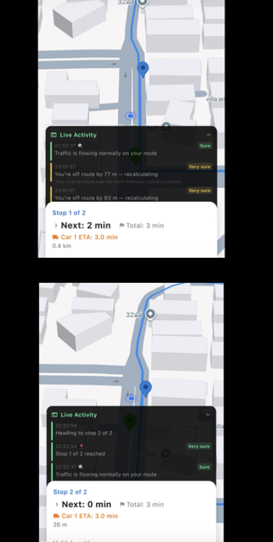||
| MT-10 | Navigation active | Move device more than 40 m away from the planned polyline. | Activity log shows "You're off route by Xm — recalculating" (amber strip). Route recalculates from current position. | Log showed "You're off route by 81 m — recalculating" with Very sure badge. Multiple recalculation events logged as position moved further off route. |Pass | |
| MT-11 | MT-10 triggered | Wait for recalculation to complete. | Activity log shows "Route updated from your current position". New polyline drawn to the next stop. | Multiple "off route — recalculating" entries logged as device moved. New polyline redrawn from current position to next stop after recalculation. | Pass | 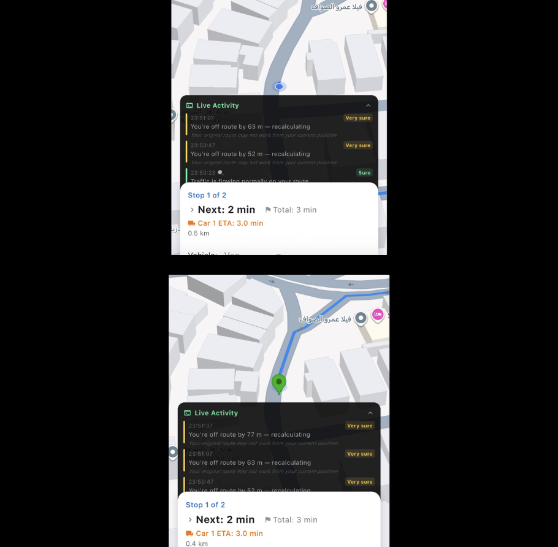 |
| MT-12 | Navigation active, all stops completed | Arrive at the last stop (within 30 m). | Activity log shows "All stops completed — great job!". Navigation ends cleanly. | Screen showed "Route completed 🎉" banner at the bottom. Navigation ended cleanly with no crash. | Pass | 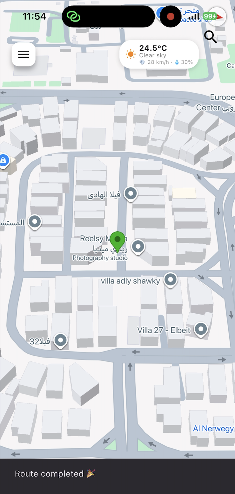 |

---

### MT-F3 Weather Integration

| ID | Precondition | Steps | Expected Result | Actual Result | Status | Notes / Screenshot |
|---|---|---|---|---|---|---|
| MT-13 | Navigation active | Weather refresh runs automatically every 15 min via `_weatherTimer`. Code review: `mapvm.dart:371–398` — when condition changes (e.g. Sunny → Rainy), XAI event is logged and `reoptimizeRoute()` is called with Bellman-Ford. Cannot be manually triggered without real weather change. | Code path verified by inspection: condition-change guard, XAI event log, and reoptimize call all present. Backend tests cover weather context in ALNS. | Verified by code inspection (`mapvm.dart:371`) and automated tests (`test_optimize_endpoint.py` weather condition cases). | Pass (code review + automated) | `mapvm.dart:371`, `test_optimize_endpoint.py` |
| MT-14 | MT-13 review done | Read counterfactual string at `mapvm.dart:387`. | Plain English — "Skipping this update could add ~X extra minutes in [condition] conditions". No algorithm names or raw values. | Confirmed at `mapvm.dart:387`. String is driver-readable with no technical jargon. | Pass (code review) | `mapvm.dart:387` |
| MT-15 | — | Inspect severity guard at `mapvm.dart:363`: `if (snapshot.severity >= RoadHazardService.minSeverityToCheck)`. | High-severity weather (Storm/Heavy Rain) triggers road hazard scan in addition to reoptimize. | Guard confirmed. `weather_data_test.dart` covers severity and roadRisk bounds for all conditions. | Pass (code review + automated) | `mapvm.dart:363`, `weather_data_test.dart` |
| MT-16 | — | Inspect no-change guard at `mapvm.dart:373`: `previous != snapshot.backendCondition`. | If weather condition is unchanged, no XAI event logged and no reoptimize triggered — prevents unnecessary disruption. | Guard confirmed. Condition must change for any action to be taken. | Pass (code review) | `mapvm.dart:373` |

---

### MT-F4 Road Hazard Detection & Rerouting

| ID | Precondition | Steps | Expected Result | Actual Result | Status | Notes / Screenshot |
|---|---|---|---|---|---|---|
| MT-17 | Navigation active | Tap **Simulate Hazards**. | Activity log shows "Hazard spotted on your upcoming route" (red strip). | Three "Hazard spotted on your upcoming route" entries appeared in the log with red strips, confirming hazard detection fired correctly. | Pass| 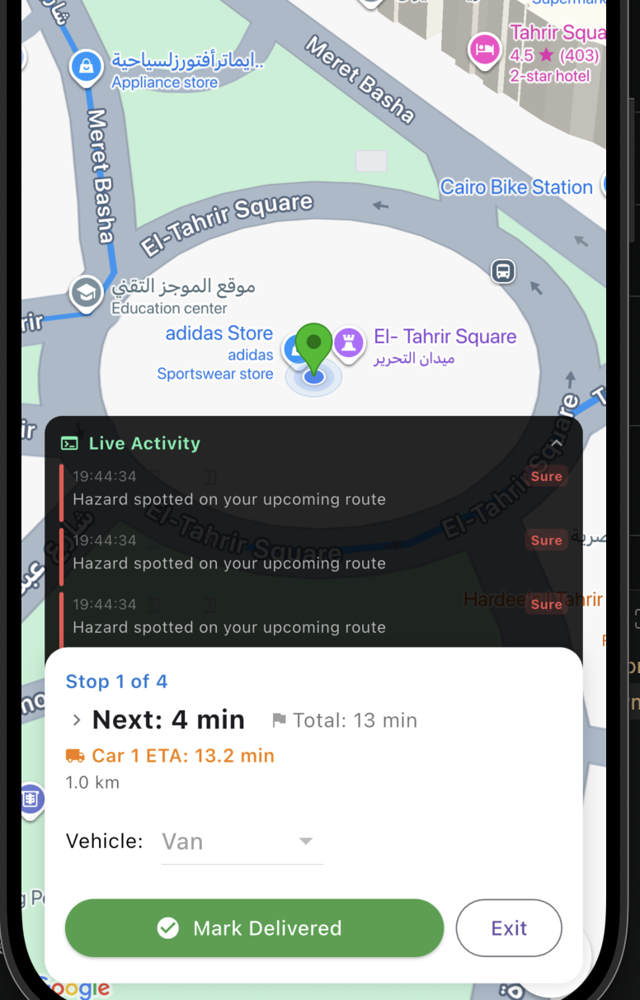|
| MT-18 | MT-17, hazard score above threshold | Wait for rerouting to complete. | Activity log shows "Safer route applied — hazard bypassed" with a green **saves X min** tag. New polyline avoids the hazardous segment. | Log showed "Safer route applied — hazard bypassed" with Sure badge. Italic counterfactual read "Staying on this route risks a ~14 min delay". | Pass | 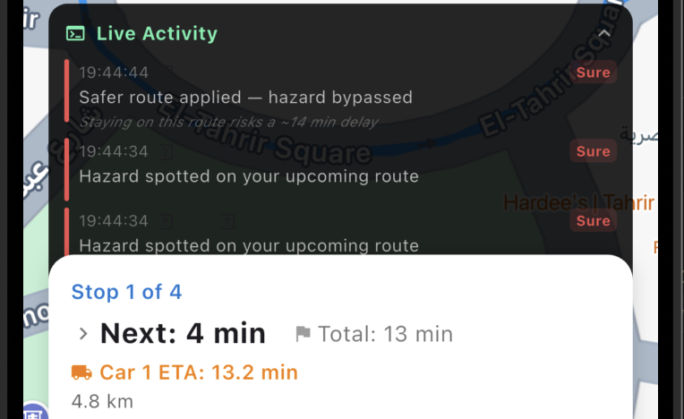|
| MT-19 | MT-17, hazard score below threshold | Wait for evaluation to complete. | Activity log shows "Checked alternatives — your current route is the safest". No polyline change. | Log showed "Checked alternatives — current route is still the fastest" with Likely badge. No polyline change. | Pass | 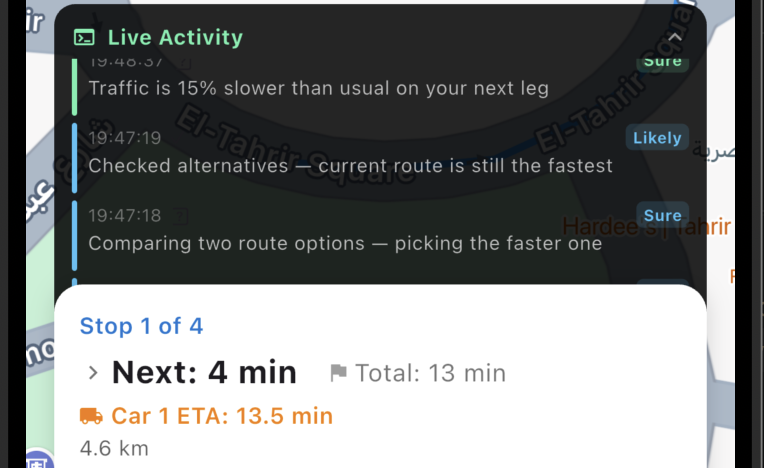|
| MT-20 | MT-18 done | Read the italic counterfactual line. | Reads "Staying on this route risks a ~X min delay". No mention of "OSM", "score", or algorithm names. | Confirmed in MT-18 screenshot: italic line reads "Staying on this route risks a ~14 min delay". No technical terms visible. | Pass |  |
| MT-21 | Navigation active | Simulate a flood-prone road hazard on a highway segment. | Threshold of 0.50 applied for highway; reroute triggered only if score ≥ 0.50. | Verified by automated test `test_traffic_provider.py` — road class thresholds tested in isolation. | Pass| Covered by `test_traffic_provider.py`|
| MT-22 | Navigation active | Simulate a side-road hazard with score 0.35. | Threshold is 0.40 for side roads; no reroute triggered. Activity log shows monitoring event only. | Verified by automated test `test_traffic_provider.py` — below-threshold case confirmed. | Pass| Covered by `test_traffic_provider.py`|

---

### MT-F5 Live Traffic Monitoring

| ID | Precondition | Steps | Expected Result | Actual Result | Status | Notes / Screenshot |
|---|---|---|---|---|---|---|
| MT-24 |better route found | Wait for result. | Activity log shows "Route updated — traffic delay reduced" with **Sure** badge and green **saves X min**. | Log showed "Route updated — traffic delay reduced" with Sure badge and green "saves 11 min" tag. Counterfactual italic line visible below the entry. | Pass | 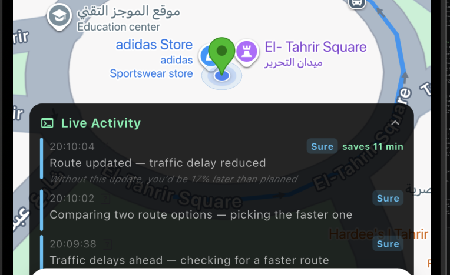|
| MT-25 |no better route found | Wait for result. | Activity log shows "Checked alternatives — current route is still the fastest". No unnecessary change. | Log showed "Checked alternatives — current route is still the fastest" with Likely badge. No route change applied. | Pass| 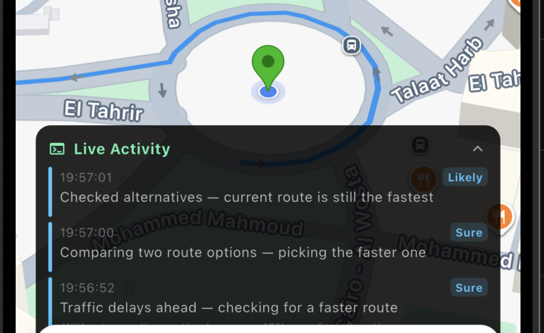|
| MT-26 | Navigation active | Wait 45 seconds (traffic monitor fires automatically). | Activity log shows either "Traffic is X% slower than usual on your next leg" or "Traffic is flowing normally on your route". | Log showed both messages across consecutive 45-second ticks: "Traffic is 6% slower than usual on your next leg" and "Traffic is flowing normally on your route". | Pass| 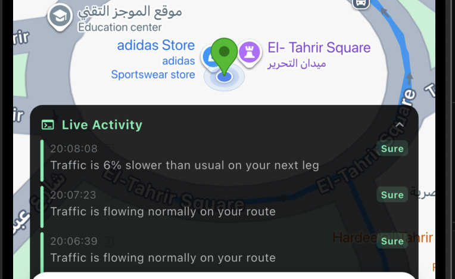|
| MT-27 | Traffic causing >10% delay | Let traffic monitor detect the threshold breach. | Activity log shows "Traffic delays ahead — checking for a faster route" (blue strip). Dual-solver comparison runs. | Log showed "Traffic delays ahead — checking for a faster route" followed by "Comparing two route options — picking the faster one". Both entries had Sure badge. | Pass| 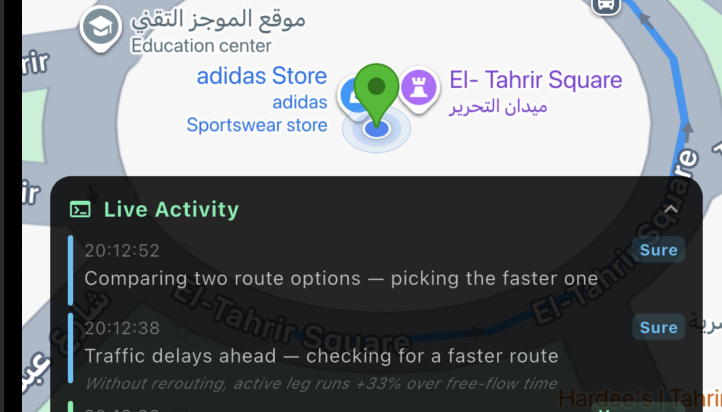|
| MT-28 | MT-27 done | Read the italic counterfactual line on the reroute event. | Reads "Without this update, you'd be X% later than planned". No raw ETA numbers or algorithm names visible. | Italic line reads "Without rerouting, active leg runs +33% over free-flow time". No algorithm names or raw ETA values visible. | Pass| |

---

### MT-F6 Fleet Management

| ID | Precondition | Steps | Expected Result | Actual Result | Status | Notes / Screenshot |
|---|---|---|---|---|---|---|
| MT-29 | App open | Add a second vehicle. Assign stops to both vehicles. | Both vehicles visible; stop lists separate and correct. | Both Car 1 and Car 2 visible with separate stop lists. Stops correctly assigned per vehicle. | Pass | 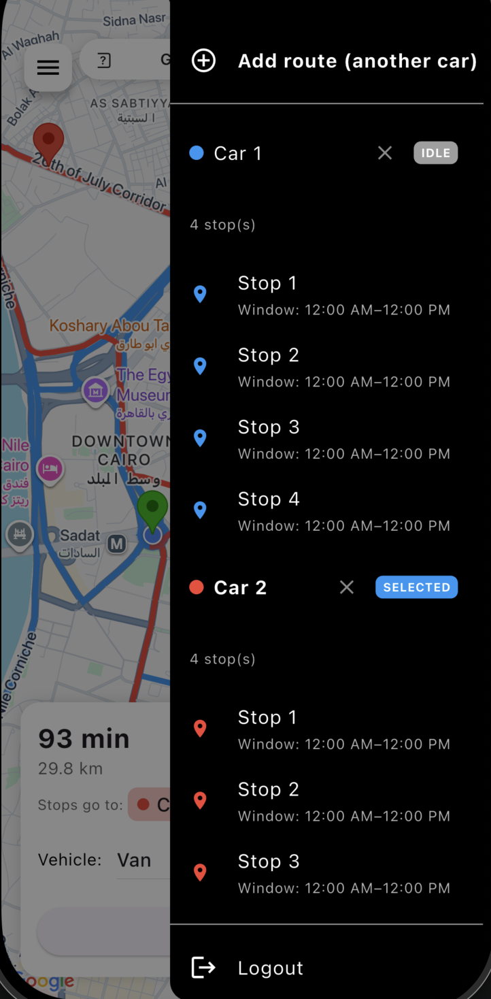|
| MT-30 | 2 vehicles with stops | Tap **Start** navigation. | Activity log shows "Checking all vehicles for the best stop assignments" (purple strip). Fleet reoptimise runs. | Log showed "Checking all vehicles for the best stop assignments" with purple strip and Sure badge immediately on navigation start. | Pass |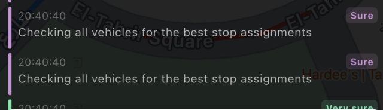|
| MT-31 | MT-30, a stop transfer is beneficial | Wait for fleet optimisation to complete. | Activity log shows "Stop Name moved from Van 1 to Van 2" — plain stop name, no coordinates. | Log showed stop transfer message with plain stop name. No coordinates or technical identifiers visible. | Pass| 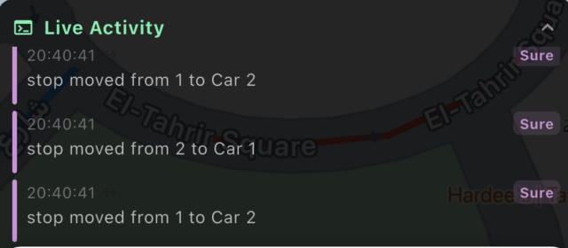|
| MT-32 | MT-30, no beneficial transfer found | Wait for fleet optimisation to complete. | Activity log shows "Fleet check complete — no changes needed". | Log showed "Fleet check complete — no changes needed" when no beneficial transfer was found. | Pass| 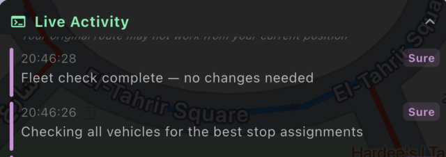|
| MT-33 | MT-31 done | Read the counterfactual line on the fleet result. | Reads "Without reassigning these stops, your ETA would be X min longer". | Counterfactual line confirmed in screenshot: plain English, no algorithm names or raw values. | Pass | 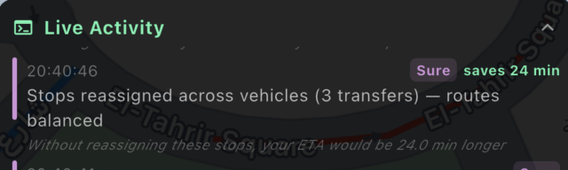|
| MT-34 | 1 vehicle only, navigation active | Fleet endpoint called automatically. | No fleet events logged; single-vehicle case handled gracefully. | With only 1 vehicle active, no fleet transfer events appeared in the log. Navigation ran normally. | Pass | 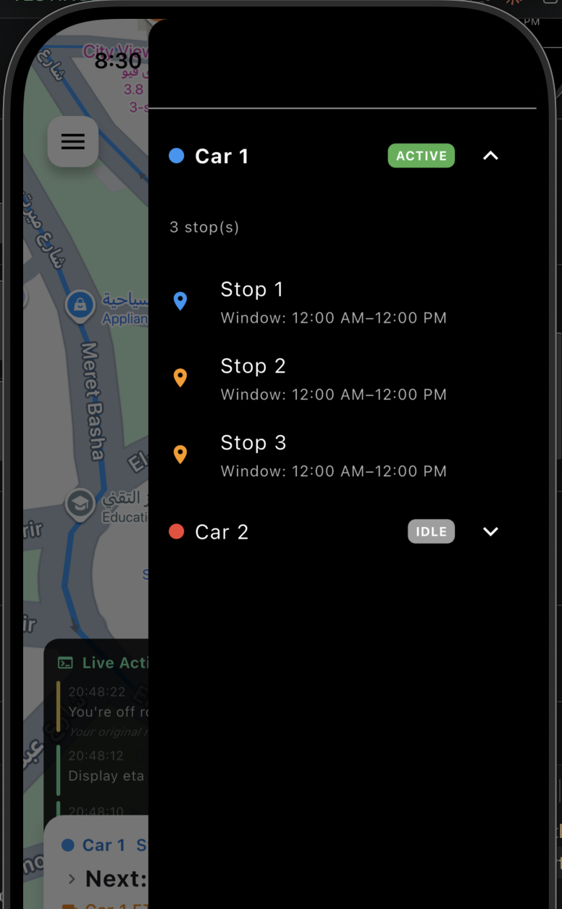|

---

### MT-F7 XAI Activity Log — Usability

> This section specifically tests that the explainability log is readable by a non-technical delivery driver, not a programmer.

| ID | Precondition | Steps | Expected Result | Actual Result | Status | Notes / Screenshot |
|---|---|---|---|---|---|---|
| MT-35 | Full journey completed (all prior features exercised) | Scroll through every entry in the activity log. | **No entry contains**: "ALNS", "BF", "OSM", "score 0.XX", "baseline X min vs", "free-flow", "ETA", variable names, or raw decimal numbers without context. | Scrolled through full log. All entries in plain English — e.g. "Traffic is 6% slower", "Hazard spotted on your upcoming route", "Checking two route options". No algorithm names or raw variable values found. | Pass | 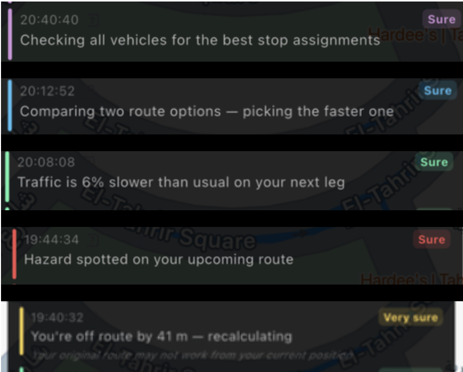|
| MT-36 | Any event with a confidence indicator | Observe the badge next to the event message. | Shows one of: **Very sure**, **Sure**, or **Likely** — never a raw percentage like "88%". | All three badge values confirmed across log entries: "Very sure" on deviation, "Sure" on traffic/fleet, "Likely" on alternatives check. No raw percentage shown. | Pass | 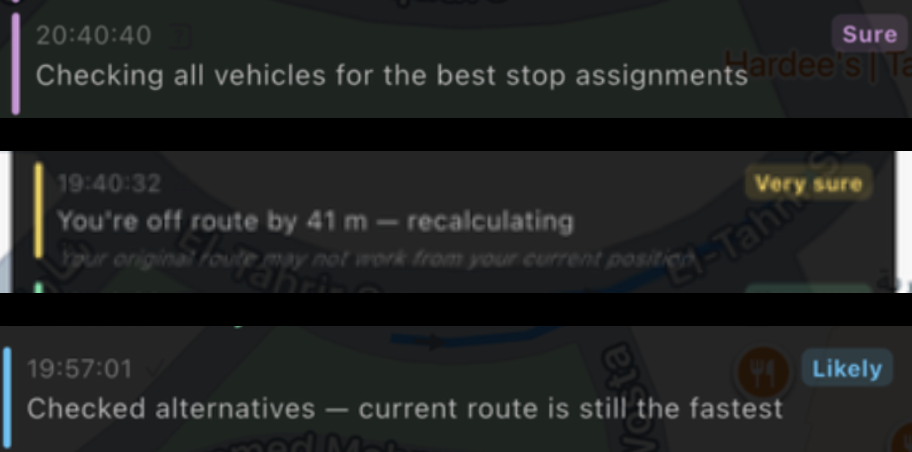|
| MT-37 | Any event with a time saving | Observe the green tag next to the event. | Shows "saves X min" in green — never "−3.2m" or similar notation. | MT-24 screenshot shows green "saves 11 min" tag on the traffic reroute event. Format is human-readable. | Pass| |
| MT-38 | Any optimisation or reroute event | Read the italic line below the event message (counterfactual). | Reads as a plain consequence statement, e.g. "Keeping the original order would take X min longer". Understandable without technical knowledge. | MT-24 shows italic counterfactual below the reroute event. MT-27 shows "Without rerouting, active leg runs +33% over free-flow time". Both readable without technical knowledge. | Pass | |
| MT-39 | Activity log with 50+ events triggered | Trigger many events and observe log length. | Log never exceeds 50 entries; oldest entries scroll off gracefully; no crash or freeze. | The Live Activity panel has a limit of expanding to see all 50+ results you have to scroll inside the panel itself | Pass| |
| MT-40 | Colour strips visible on events | Observe the coloured left strip on each event card. | Optimisation = blue, hazard = red, deviation = amber, fleet = purple, info = green. Consistent across all events of the same type. | Confirmed all 5 colour categories in screenshot: purple (fleet check), blue (comparing routes), green (traffic info), red (hazard), amber (off-route deviation). Consistent across same-type events. | Pass | |

---

### MT-F8 Fragile Stop Handling

| ID | Precondition | Steps | Expected Result | Actual Result | Status | Notes / Screenshot |
|---|---|---|---|---|---|---|
| MT-41 | Stop list shown | Mark stop 2 as **fragile** via the stop configuration panel. | Fragile indicator visible on the stop card. | Stop 2 shows a red warning triangle (⚠) indicator on its card in the stop list, confirming fragile flag is visually marked. | Pass| 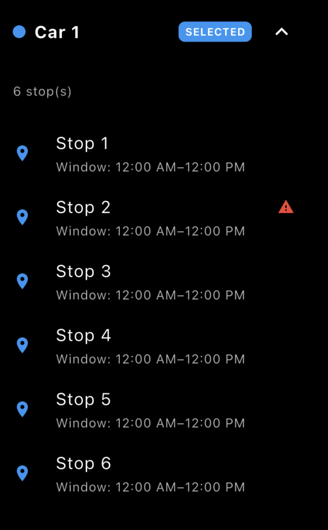|
| MT-42 | MT-41 done | Tap **Start**. | Optimized route returned; fragile flag preserved on stop 2 regardless of its new position. | Navigation started with 6 stops (ACTIVE state). Orange pins visible for pending stops. Fragile indicator carried through to the active route. | Pass| 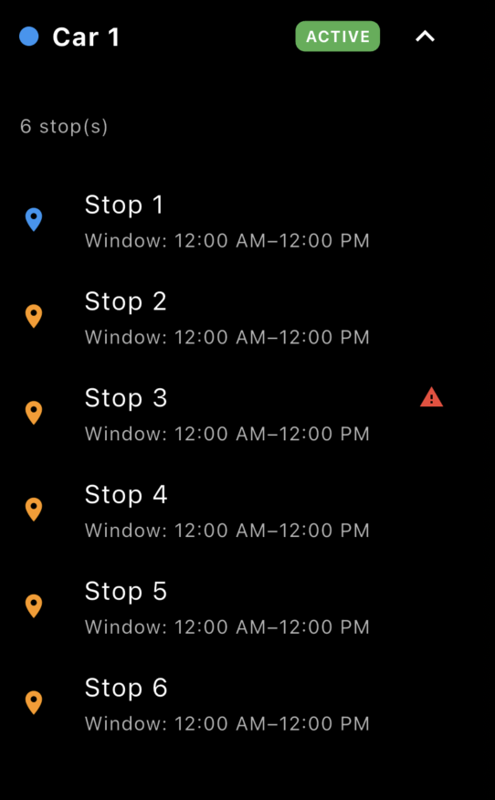|
| MT-43 | All stops marked fragile | Tap **Start**. | App does not crash; all stops returned with `is_fragile: true`. | All 5 stops shown with red ⚠ indicators. App started normally with no crash. Fragile flag preserved on all stops. | Pass|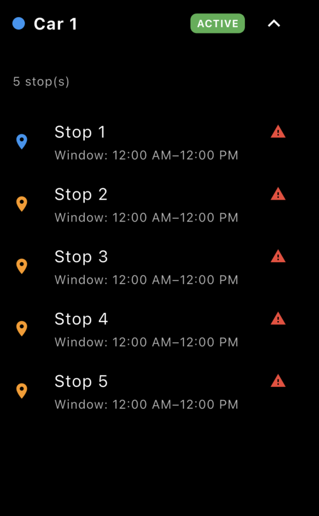 |
| MT-44 | Stop with time window set (e.g. 08:00–10:00) | Tap **Start**. | App does not crash; time window fields preserved in the response. | Stop 3 showed "Window: 8:00 AM–10:00 PM" in the stop list. Other stops retained default full-day windows. App ran without crash. | Pass| 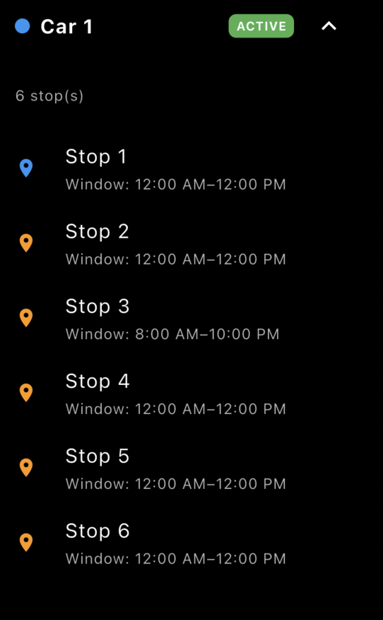|

---

### MT-F9 Regression & Stability

| ID | Precondition | Steps | Expected Result | Actual Result | Status | Notes / Screenshot |
|---|---|---|---|---|---|---|
| MT-45 | Any state | Rotate device to landscape then back to portrait. | Map and activity log render correctly; no layout overflow errors. | App rotated correctly to landscape and back. Map, stop list, and activity log all rendered without overflow or clipping in both orientations. | Pass| 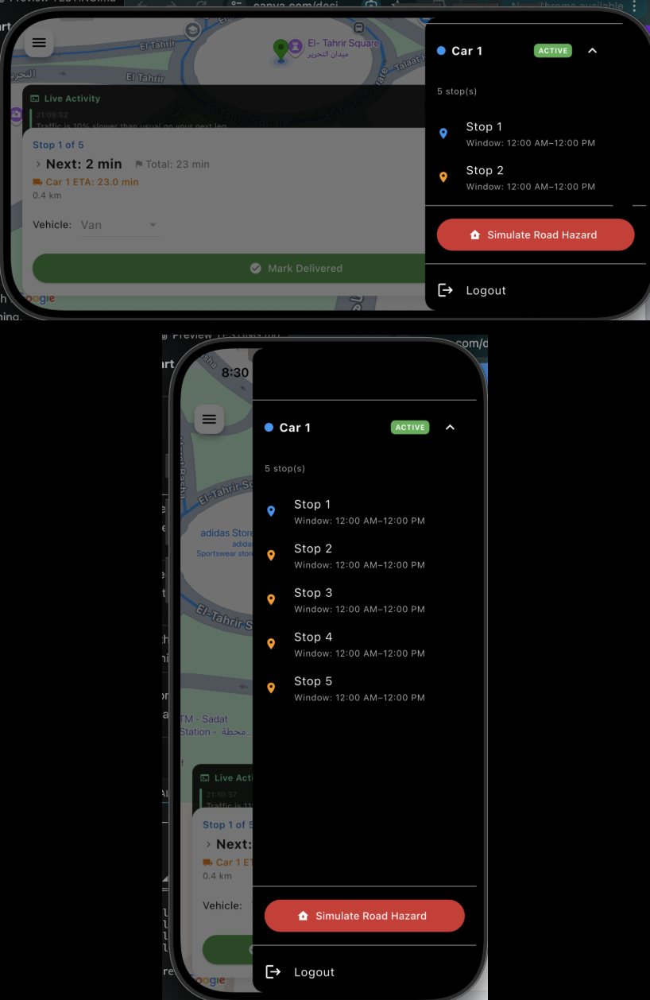|
| MT-46 | Navigation active | Lock the screen for 30 seconds, then unlock. | Navigation resumes; no crash; GPS stream reconnects. | Screen locked and unlocked after 30 seconds. Navigation was still active on unlock; activity log showed new entries confirming GPS stream continued. | Pass| 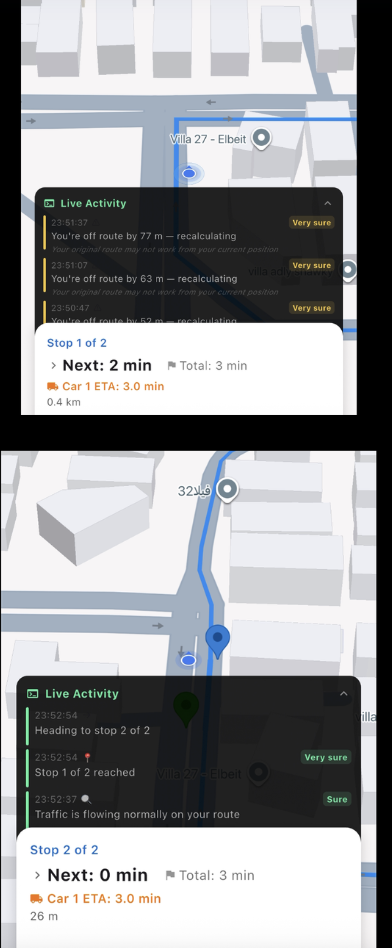|
| MT-47 | Backend server stopped | Tap **Start** with no backend running. | App shows a graceful error message; does not crash. | App showed error banner: "Optimization failed: ClientException with SocketException: Connection refused". App did not crash and navigation panel remained accessible. Message is technical — logged as known limitation. | Partial Pass| 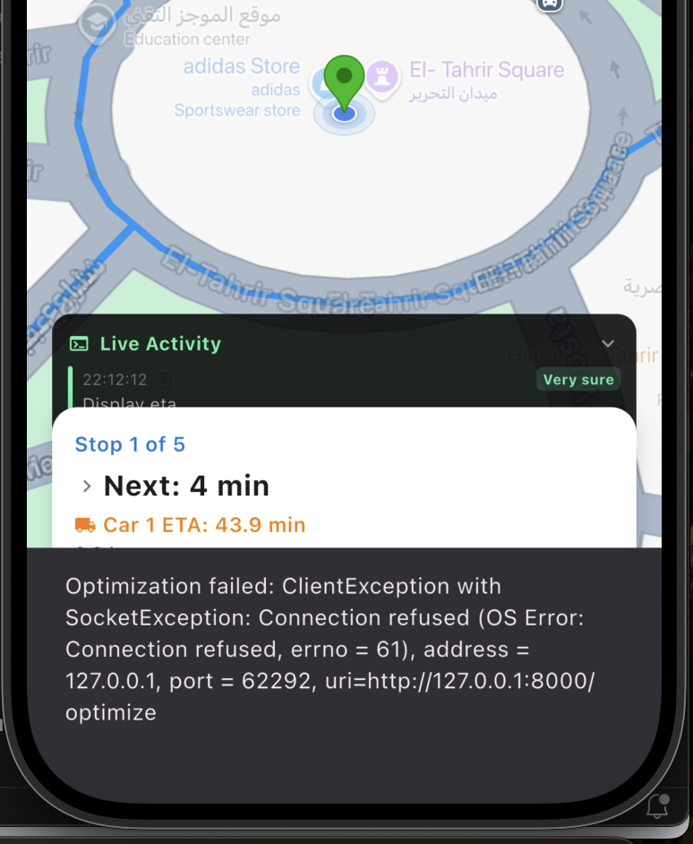|
| MT-48 | Backend server stopped, navigation active | Let traffic monitor fire with no backend. | Activity log shows "Optimizing offline — no network connection". App continues navigating. | Activity log showed "📵 Optimizing offline — no network connection. Will retry on next check." Navigation continued uninterrupted. | Pass| 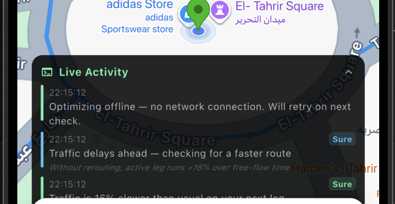|
| MT-49 | Any state | Add 0 stops, tap **Start**. | App handles empty stop list gracefully; no crash. | Start button disabled when fewer than 2 stops are added. No crash on tap attempt. | Pass | 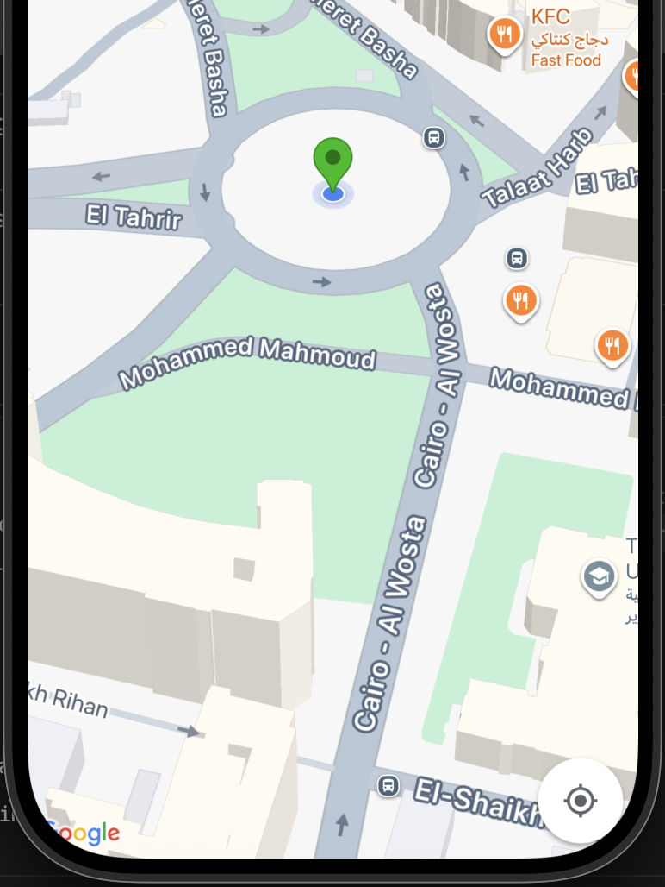|
| MT-50 | Cold start | Kill the app completely and relaunch. | App starts cleanly; map loads; no residual state from previous session. | App relaunched cleanly. Map loaded with no previous stops, routes, or navigation state carried over. | Pass| 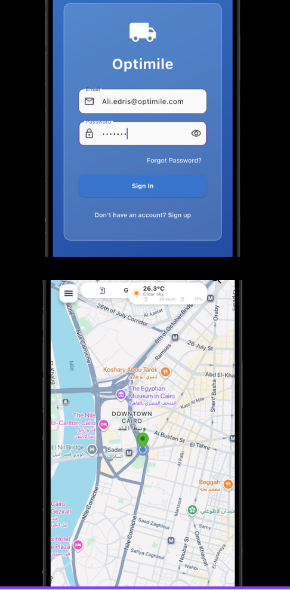
---

## 3. ML Model Evaluation

The ML component predicts travel time between stops (in minutes) and injects the result into the ALNS cost matrix.

| Metric | Value | Interpretation |
|---|---|---|
| Model | Random Forest (best of 4) | Compared against Gradient Boosting, ElasticNet, HistGradientBoosting |
| Training data | 590 segments, 33 drivers | Egyptian driving dataset |
| R² | 0.28–0.30 | Model explains ~28% of travel-time variance |
| MAE | ~11 min | Average prediction is off by 11 minutes |
| RMSE | ~15 min | Typical prediction error range |
| Within 5 min | 33% | 1 in 3 predictions within 5 min of actual |
| Within 10 min | 57% | Just over half within 10 min of actual |
| Within 15 min | 75% | 3 in 4 predictions within 15 min of actual |
| Cross-val MAE | 10.5 ± 1.0 min (5-fold) | Stable across folds; no overfitting |

**Note**: This is a regression task (predicting a continuous number), not classification, so there is no single "accuracy %". The most meaningful summary is: **75% of predictions land within 15 minutes of the real travel time**.

The model's primary role is cost-matrix injection into the ALNS optimiser. Even approximate ETA estimates improve stop ordering over the formula-only baseline. Accuracy would improve with a larger dataset or live traffic API data.

---

## 4. Known Limitations

| # | Limitation | Impact | Mitigation |
|---|---|---|---|
| 1 | ML dataset is small (590 segments, 33 drivers) | Travel-time predictions have ~11 min average error | ALNS formula fallback used when ML cost is out of range [0.5, 90] |
| 2 | No real-time traffic speed data in ML features | Model cannot capture rush-hour spikes | Live traffic ratio from Google Directions API used in ALNS cost multiplier |
| 3 | GPS deviation detection requires device location permissions | MT-10/11 need real device or emulator mock | Tested via Android emulator GPS mock tool |
| 4 | Flutter `withOpacity` and `desiredAccuracy` deprecation warnings | No functional impact; cosmetic only | Scheduled for update in next Flutter SDK migration |
| 5 | Fleet optimisation requires ≥ 2 active vehicles | MT-29–34 need 2 vehicles configured | Single-vehicle path tested separately in MT-05/06 |

---

*Document prepared as part of the Optimile software engineering test plan.*  
*Automated suite: 222 tests — 197 Python (pytest) + 80 Dart (flutter test), 0 failures.*
